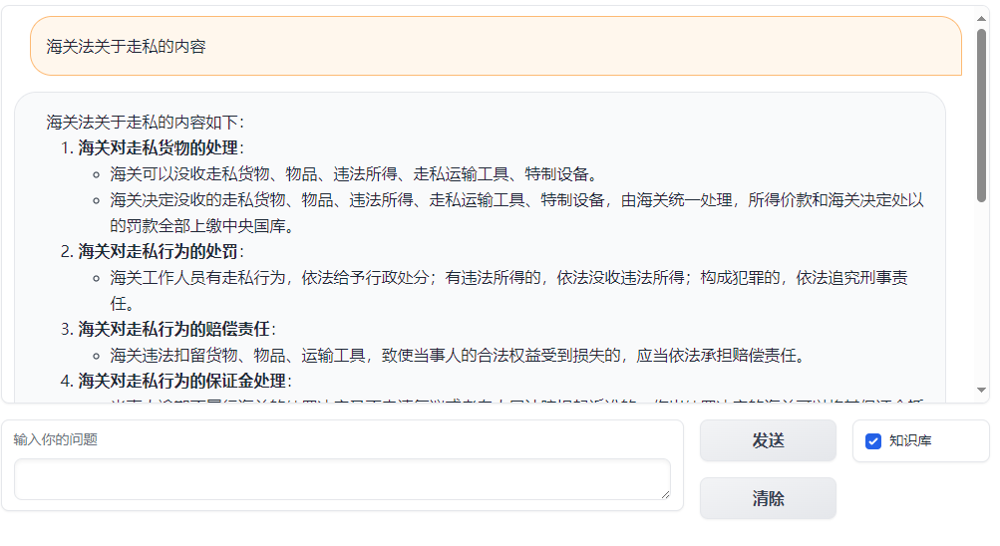
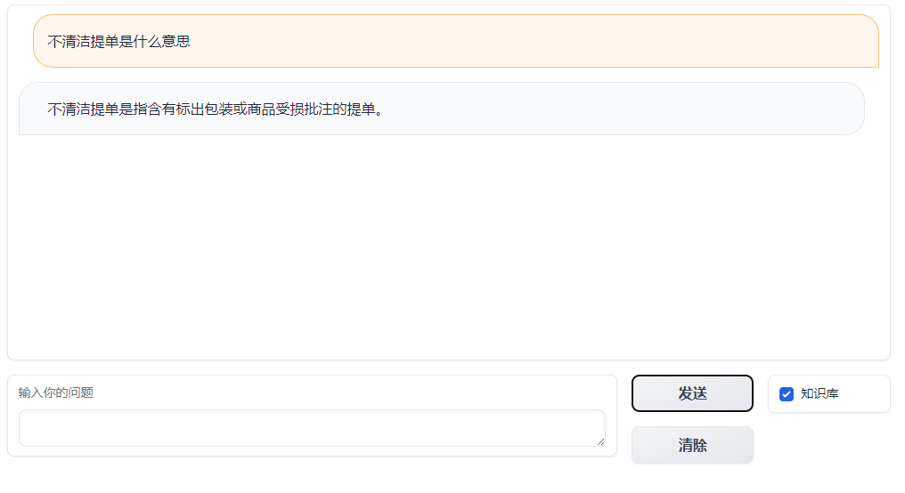
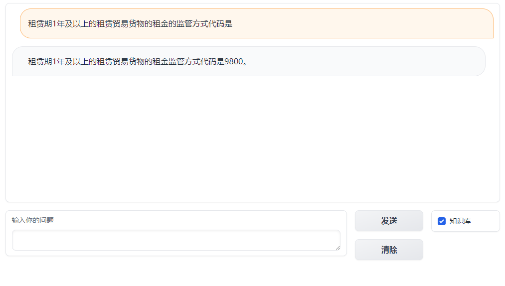

# CustomsQA 外贸小助手

[](https://openxlab.org.cn/apps/detail/peek/CustomsQA)  


## 简介

使用上海人工智能实验室的Internlm2-chat-7b模型为基础，实现外贸相关知识的问答。

## 介绍

**知识库包含的内容：**

- 中华人民共和国海关法
- 中华人民共和国海关关衔条例
- 中华人民共和国船舶吨税法
- 中华人民共和国国境卫生检疫法
- 中华人民共和国进出口商品检验法
- 中华人民共和国进出境动植物检疫法
- 中华人民共和国食品安全法
- 国家代码
- 货币代码
- 运输方式代码
- 监管方式代码
- 关区代码
- 贸易便利化术语
- HS商品编码

**代码说明：**

app.py为代码主体。  
requirements.txt为需要安装的python库。  
chroma文件夹是根据上述内容生成的向量库。  

代码开发过程中使用了langchain、xtuner和lmdeploy。  
以上库或者工具的具体使用方法请参考[教程](hhttps://github.com/InternLM/tutorial)  

**运行环境要求：**  

要求支持英伟达FastTransform的显卡(A100和A10等Volta和Turing架构GPU)，程序运行后占用显存约17GB。  
本项目在A10(24GB)和A100(20GB)成功运行。  

**运行方式：**

```
pip install -r requirements.txt
python app.py
```

**运行截图：**




**遗留问题：**

- 对于代码表之类的短语回答不准确。
- 知识库的内容较少，需要进一步收集。
- 问答形式微调效果不好，需要选择合适的问题，重新进行微调。

## 致谢

感谢上海人工智能实验室组织的这次培训活动并无偿提供了算力平台！
